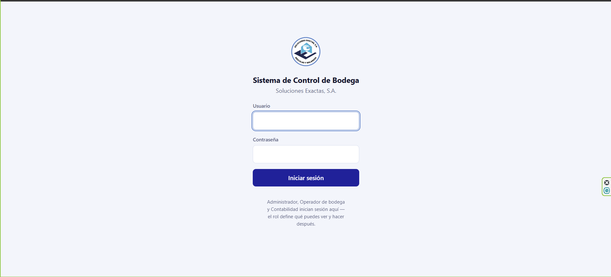
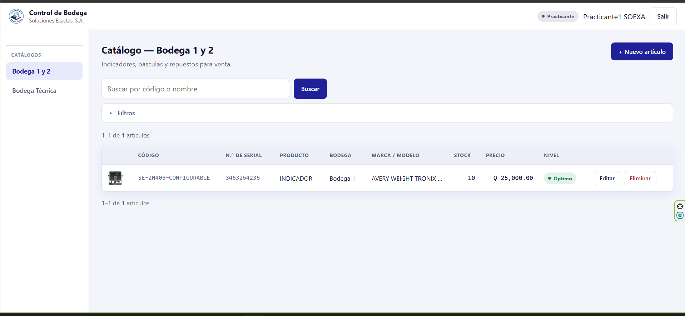
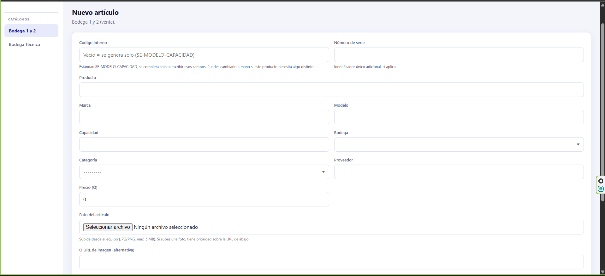
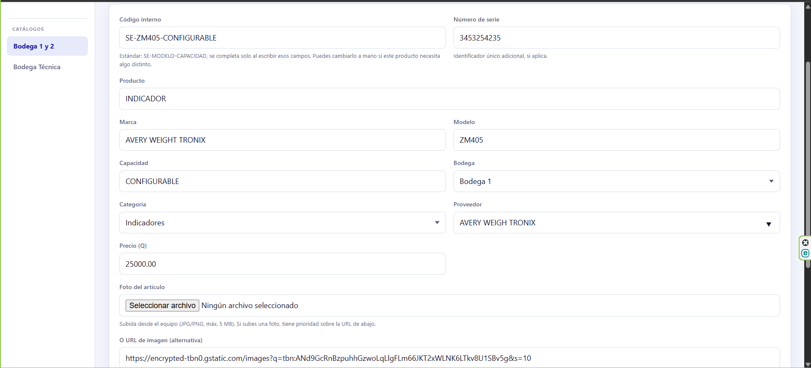
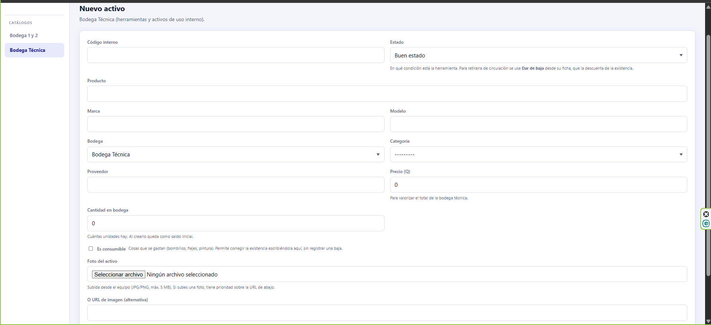
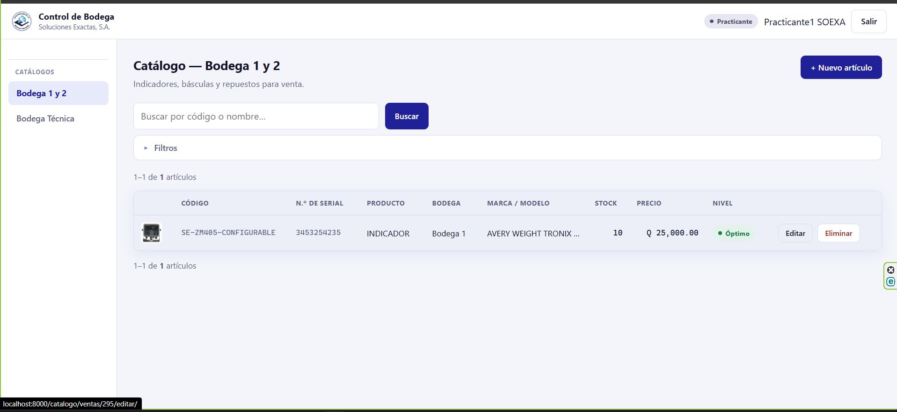
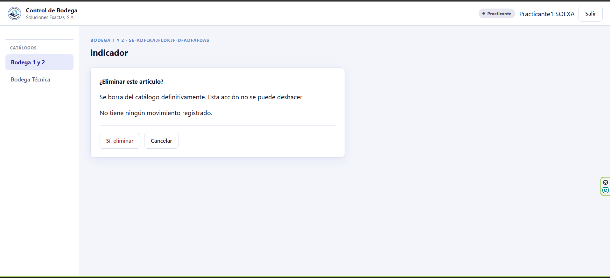
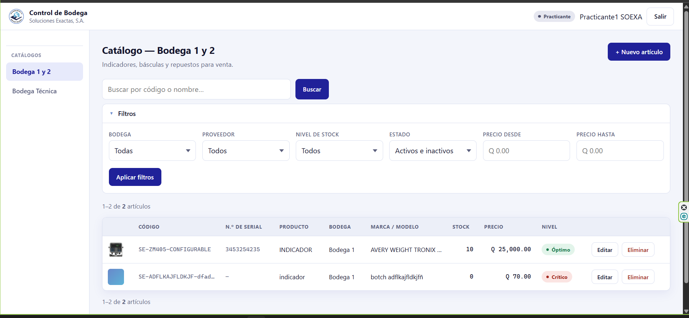

# Manual del practicante — Control de Bodega

**Soluciones Exactas, S.A.**

Tenés dos trabajos en el sistema:

1. **Dejar el catálogo bien capturado**: que cada producto de las bodegas esté
   registrado, con su nombre correcto, su marca, su precio y su foto.
2. **Registrar las entradas y salidas de Bodega 1 y 2**: las boletas de lo que
   entra y de lo que sale.

Lo de **Bodega Técnica** es distinto: ahí capturás herramienta en el catálogo,
pero los préstamos y las bajas no te tocan. Tampoco los reportes. Si intentás
entrar a esas pantallas el sistema te lo va a impedir — **no es que hiciste
algo mal**, es que no son parte de tu trabajo.

---

## Índice

1. [Cómo entrar](#1-cómo-entrar)
2. [Lo que vas a ver](#2-lo-que-vas-a-ver)
3. [Agregar un producto a Bodega 1 y 2](#3-agregar-un-producto-a-bodega-1-y-2)
4. [Agregar una herramienta a Bodega Técnica](#4-agregar-una-herramienta-a-bodega-técnica)
5. [Corregir un producto ya capturado](#5-corregir-un-producto-ya-capturado)
6. [Eliminar un producto](#6-eliminar-un-producto)
7. [Buscar y filtrar](#7-buscar-y-filtrar)
8. [Registrar entradas y salidas](#8-registrar-entradas-y-salidas)
9. [Errores comunes](#9-errores-comunes)
10. [Cuándo avisarle al encargado](#10-cuándo-avisarle-al-encargado)

---

## 1. Cómo entrar

Desde cualquier computadora **conectada a la red de la oficina**, abrí el
navegador y entrá a:

```
http://192.168.1.200:8000
```

No necesitás internet: el sistema vive en una computadora de la oficina. Si el
internet está caído, igual funciona.

Escribí tu usuario y tu contraseña. El usuario se escribe **sin importar
mayúsculas** (da igual `ana` que `Ana`), pero la contraseña sí las distingue.

> **En tablet o celular**: el teclado a veces pone la primera letra en
> mayúscula sola. En el usuario no importa; en la contraseña, revisá que no te
> haya cambiado nada.

<!-- CAPTURA: pantalla de inicio de sesión -->


---

## 2. Lo que vas a ver

Al entrar caés directo en el **Catálogo de Bodega 1 y 2**.

En la barra de la izquierda vas a tener tres opciones:

| Opción | Qué contiene |
|---|---|
| **Bodega 1 y 2** | Lo que la empresa vende: indicadores, básculas, celdas de carga, repuestos |
| **Bodega Técnica** | Herramienta e insumos de uso interno: taladros, llaves, brocas, pintura |
| **Entradas y salidas** | Las boletas de Bodega 1 y 2: lo que entra y lo que sale (sección 8) |

Arriba a la derecha aparece tu nombre de usuario con la etiqueta
**Practicante**, y el botón **Salir**.

<!-- CAPTURA: catálogo de Bodega 1 y 2 con la barra lateral visible -->


---

## 3. Agregar un producto a Bodega 1 y 2

Entrá a **Bodega 1 y 2** y hacé clic en **+ Nuevo artículo** (arriba a la
derecha).

<!-- CAPTURA: formulario de nuevo artículo, vacío -->


### Los campos, uno por uno

| Campo | ¿Obligatorio? | Qué poner |
|---|---|---|
| **Código interno** | No | **Dejalo vacío.** El sistema lo arma solo |
| **Lleva número de serie** | — | Marcala **solo** si el equipo se controla uno por uno por su serial |
| **Números de serie** | No | Solo si marcaste la casilla. Uno por uno, con Enter |
| **Producto** | **Sí** | El nombre, como aparece en la factura |
| **Marca** | No | BRECKNELL, LOCOSC, AND… |
| **Modelo** | No | LP7510, SE-7120… |
| **Capacidad** | No | 300 kg, 5 t, 200x0.01 g… |
| **Bodega** | **Sí** | Bodega 1 o Bodega 2 |
| **Categoría** | No | Elegí de la lista |
| **Proveedor** | No | Elegí de la lista **o escribí uno nuevo** |
| **Precio (Q)** | **Sí** | El precio del producto |
| **Foto** | No | JPG o PNG, máximo 5 MB |
| **Stock óptimo / alerta / crítico** | **Sí** | Vienen con 20 / 5 / 2 |
| **Activo** | — | Dejalo marcado |

### Lo importante de cada uno

**Código interno — dejalo vacío.** El sistema lo arma con el estándar
`SE-MODELO-CAPACIDAD`. Si escribís modelo `LP7510` y capacidad `300kg`, queda
`SE-LP7510-300kg`. Si ya existe otro igual, le agrega `-2` al final para que no
se repita.

**Lleva número de serie — esta casilla decide cómo se controla el producto.**
Es lo más importante de esta pantalla, así que leelo despacio.

**Sin marcar** (así viene, y es el caso más común): el producto se lleva **por
cantidad**. Un tornillo es un tornillo; da igual cuál de los 500 agarres. En
la columna de serial el sistema escribe **S/S** solo, y así sale en el
catálogo, en la ficha y en el Excel.

**Marcada**: cada aparato se controla **por separado, por su número de serie**.
Cuatro indicadores del mismo modelo son un solo producto en el catálogo pero
cuatro unidades distintas, y el sistema sabe cuál está en bodega y cuál se
vendió.

> **¿Cuál marco?** Preguntale al encargado si tenés duda. La regla es
> sencilla: si al equipo se le puede leer una placa con un número y a la
> empresa le importa *cuál* de ellos entregó, va marcada. Un indicador, una
> báscula, un módulo: marcados. Un conector, un adaptador genérico, un
> tornillo, un rollo de cable: **sin marcar**.

**Números de serie — solo si marcaste la casilla.** El campo está apagado y en
gris hasta que la marqués.

Escribí un serial y dale **Enter**. Se agrega como una etiqueta y al lado te va
diciendo cuántas unidades llevás. Seguí con el siguiente. Si te equivocaste en
uno, la **×** de su etiqueta lo quita.

**Si los tenés en una hoja de Excel, copiá la columna y pegala**: se reparten
solos, uno por renglón. No hace falta meterlos de uno en uno.

> **Un serial no se repite en todo el sistema.** Si escribís uno que ya
> existe, la etiqueta sale **en rojo y tachada**, y el aviso te dice en qué
> producto está. No esperés a guardar: corregilo ahí mismo. Suele ser que ya
> lo cargaste antes, o que te bailó un número.

**Solo se capturan al crear el producto.** Cuando lo edités después, el campo
ya no aparece — y es a propósito. De ahí en adelante cada aparato entra por su
**boleta de ingreso**, que es lo que deja el respaldo de cuándo llegó y con
qué documento. Si te falta uno, no lo agregues por acá: avisale al encargado
para que lo ingrese con su boleta.

**Producto** es el único que no se puede dejar vacío. Escribilo completo y sin
abreviar: `INDICADOR DE PESO DIGITAL`, no `IND. PESO`. Después alguien va a
buscar ese producto por su nombre.

**Proveedor**: es una caja de texto con sugerencias. Escribí las primeras
letras y elegí de la lista. **Si el proveedor no está, escribilo completo y se
crea solo.** Antes de inventarlo, fijate bien en la lista: `BRECKNELL` y
`Brecknell` son el mismo, pero `BRECNELL` mal escrito queda como uno nuevo y
duplicado.

**Precio**: es obligatorio y se usa para calcular cuánto vale el inventario. Si
de verdad no lo sabés, poné `0` y avisale al encargado — pero no lo inventes.

**Foto**: subila desde la computadora con el botón *Foto del artículo*.

> ⚠️ **No uses el campo de URL de imagen con enlaces de Google.** Esos enlaces
> se caen solos con el tiempo y la foto queda rota. Si ya tenés la imagen,
> guardala en la computadora y subila como archivo.

**Los tres números de stock** dicen cuándo avisar que hay que reponer:

- **Óptimo (20)**: lo que se considera bien surtido
- **Alerta (5)**: por debajo de esto, el sistema avisa en amarillo
- **Crítico (2)**: por debajo de esto, avisa en rojo

Tienen que cumplir: **crítico ≤ alerta ≤ óptimo**. Si no, el sistema no te deja
guardar. Dejá los que vienen salvo que el encargado te diga otra cosa.

Al terminar, **Guardar**.

<!-- CAPTURA: formulario lleno, justo antes de guardar -->


---

## 4. Agregar una herramienta a Bodega Técnica

Entrá a **Bodega Técnica** y hacé clic en **+ Nuevo activo**.

Es parecido al anterior, pero con tres diferencias importantes.

<!-- CAPTURA: formulario de nuevo activo -->


### Diferencia 1 — el código interno **sí** lo escribís vos

Acá el código **no** se genera solo: lo asigna la empresa. Usá el que ya tenga
la herramienta en el listado (`SE-TE001`, `SE-EP012`…). Si no sabés cuál va,
preguntale al encargado antes de inventar uno.

### Diferencia 2 — un activo nace en **0**

El campo **Cantidad en bodega** aparece bloqueado y con un `0`. **Es a
propósito, no está fallando.** Igual que en Bodega 1 y 2, la cantidad no se
escribe en el catálogo: entra con un ingreso.

Lo que sí seguís haciendo igual: **un producto, no uno por unidad.** Si hay 43
abrazaderas de 1/2", capturás *una* abrazadera de 1/2" — no 43 productos.

### Diferencia 3 — el interruptor de consumible

Marcá **Es consumible** en las cosas que se gastan: bombillos, flejes, pintura,
brocas, tornillos, abrazaderas, cinta.

Es lo que decide **cómo entra la cantidad**:

- **Marcado**: guardás, volvés a entrar con **Editar** y ahí sí escribís
  cuántas hay. Son dos pasos, pero es todo tuyo.
- **Sin marcar**: la cantidad solo entra con un ingreso (FO-SE-013) o cambia
  con una baja, y eso **lo hace el encargado** — vos dejás el activo en 0.

Ante la duda, dejalo **sin marcar** y preguntá: es más fácil marcarlo después
que deshacer una cantidad que nunca debió entrar.

> **La regla de fondo:** toda cantidad que entra a bodega tiene que tener algo
> que la respalde — una boleta, o alguien que la contó y la corrigió a mano
> quedando registrado. Por eso el campo está bloqueado al crear.

### El estado

Son tres, y van de mejor a peor:

| Estado | Cuándo se usa |
|---|---|
| **Buen estado** | Sirve bien, no hay nada que decir |
| **Próximo a reemplazo** | Todavía sirve y se sigue prestando, pero está gastada y hay que ir comprando la de repuesto |
| **Mal estado** | Ya no sirve |

**Próximo a reemplazo** es el que más ayuda al encargado: es el aviso de que
hay que comprar *antes* de quedarse sin la herramienta. Si la ves gastada,
usalo — no esperes a que se termine de arruinar.

Si algo ya no sirve, **no lo captures como Mal estado y ya** — avisale al
encargado, porque darlo de baja es otra cosa que él tiene que registrar.

---

## 5. Corregir un producto ya capturado

Buscalo en el catálogo y hacé clic en **Editar**, o entrá a su ficha y usá el
botón **Editar** de arriba.

<!-- CAPTURA: fila del catálogo con los botones Editar y Eliminar -->


Corregí lo que haga falta y **Guardar**. Corregir el nombre o la marca de un
producto **no borra nada**: sigue siendo el mismo producto con su historial.

> **Ojo con el código interno al editar**: si lo borrás y guardás, el sistema
> lo vuelve a generar. Eso está bien si querés regenerarlo, pero si el producto
> ya estaba etiquetado físicamente con un código, dejalo como está.

**Los números de serie no aparecen al editar.** Es a propósito: una vez creado
el producto, cada aparato entra por su boleta de ingreso, que es lo que deja
constancia de cuándo llegó. Si te faltó cargar uno o cargaste uno de más,
avisale al encargado — no hay forma de arreglarlo desde acá, y está bien que
no la haya.

---

## 6. Eliminar un producto

Solo para lo que capturaste por error. Buscalo, hacé clic en **Eliminar**, y
confirmá en la pantalla que aparece.

<!-- CAPTURA: pantalla de confirmación de eliminación -->


### Si el sistema no te deja

Vas a ver un mensaje que dice **"No se puede eliminar"**. No es un error tuyo:
significa que ese producto **ya tiene historial** — alguien registró una
entrada, una salida, un préstamo o una baja con él.

Borrarlo dejaría esos registros sin saber a qué producto pertenecían, así que
el sistema lo protege. **Avisale al encargado**: él decide qué hacer.

---

## 7. Buscar y filtrar

**El buscador** de arriba encuentra por código, por nombre y **por número de
serie**. No hace falta escribir completo: con `celda` aparecen todas las celdas
de carga, y pegando el serial de un aparato te lleva directo a su producto —
sirve para comprobar si ya lo cargaste, sin ir a buscarlo a mano.

**Filtros** (el desplegable debajo del buscador) sirve para acotar: por bodega,
por proveedor, **por categoría** y por rango de precio. Se pueden combinar
varios a la vez.

> El filtro de categoría trae una opción **— Sin categoría —**: son los
> productos que todavía no tienen ninguna. Es la forma de encontrarlos para
> irles poniendo la suya, en vez de ir revisando el catálogo entero.

Al lado del botón *Filtros* aparece un número cuando hay filtros puestos. **Si
un producto que sabés que existe no aparece, revisá ese número** — casi siempre
es un filtro que quedó activo. Con **Limpiar todo** vuelve a verse el catálogo
completo.

<!-- CAPTURA: buscador y filtros abiertos -->


---

## 8. Registrar entradas y salidas

Además del catálogo, ahora también registrás las boletas de **Bodega 1 y 2**:
lo que entra (FO-SE-013) y lo que sale (FO-SE-012).

> **Esto no es capturar, es mover inventario.** Lo que registrés acá cambia la
> existencia de verdad. Si te equivocás, no lo arreglés registrando otro
> movimiento al revés — avisale al encargado.

Entrá a **Entradas y salidas** en la barra de la izquierda, y usá **+ Ingreso**
o **+ Salida** según lo que traigas.

<!-- CAPTURA: la pantalla de Entradas y salidas con los dos botones -->


### Los datos de arriba

| Campo | Qué poner |
|---|---|
| **Número de boleta** | **El que trae impreso el papel.** El sistema propone el siguiente de la serie, pero si tu talonario va en otro, cambialo |
| **Fecha del movimiento** | Viene la de hoy. Si estás digitando una boleta de ayer, cambiala a la del papel |
| **Tipo de movimiento** | Venta, Préstamo/Demo, Repuestos o Materiales/Otro |
| **Solicitado por** | Quién pidió el movimiento |
| **No. de factura** | El de la factura del proveedor, si hay |

En la **salida** aparecen tres más: **Entregado por**, **Cliente** y
**Envío / recibo**.

### Los productos

Escribí parte del código o del nombre y elegí de la lista. Debajo de la línea
te dice la bodega y cuánto hay, para que confirmes que agarraste el correcto.

Con **+ Agregar línea** ponés tantos productos como traiga la boleta.

**El precio** viene puesto con el del catálogo. Si la factura trae otro,
escribí el de la factura: ese es el que queda guardado en esta boleta.

### Si el producto lleva número de serie

Ahí la cosa cambia: **la cantidad no se escribe**.

- En un **ingreso**, ponés los seriales de los aparatos que están llegando,
  uno por uno con Enter. La cantidad se pone sola.
- En una **salida**, el sistema te muestra los seriales que hay en bodega y
  vos marcás cuáles salen.

> **Si el serial del equipo que tenés en la mano no aparece en la lista de la
> salida, no registrés nada.** Ese aparato figura como ya entregado. Avisale al
> encargado.

Al terminar, **Registrar ingreso** o **Registrar salida**. Vas a caer en la
boleta ya guardada, con el botón para imprimirla en PDF y firmarla.

<!-- CAPTURA: la boleta guardada, con el botón de imprimir -->


### Devolver un préstamo o demo

Cuando vuelva el equipo que salió como **Préstamo / Demo**, buscá esa boleta en
Entradas y salidas y usá **Registrar regreso**. Ahí ponés la fecha y quién lo
devolvió. La existencia vuelve sola.

### Lo que NO te toca

- **Los préstamos de herramienta** de Bodega Técnica (FO-SE-066)
- **Dar de baja** existencia en Bodega Técnica
- Los **reportes** y el **kardex** de un producto

Si necesitás alguna de esas, es del encargado de bodega.

---

## 9. Errores comunes

| Lo que ves | Qué pasó | Qué hacer |
|---|---|---|
| **"No se puede eliminar"** | El producto ya tiene historial | Avisar al encargado |
| **"Los umbrales deben cumplir: crítico ≤ alerta ≤ óptimo"** | Los tres números de stock están en desorden | Revisar que el crítico sea el más chico y el óptimo el más grande |
| **"Ya existe un artículo con ese código interno"** | Se repitió un código | En Bodega 1 y 2, dejá el código vacío. En Técnica, revisá cuál le toca |
| **Un serial sale en rojo y tachado** | Ese número ya está cargado | El aviso dice en qué producto está. Buscálo con el buscador antes de cargarlo de nuevo; si te bailó un número, corregilo |
| **"se controla por número de serie: hay que indicar el de cada unidad"** | El producto tiene la casilla marcada y no le pusiste ningún serial | O le ponés los seriales, o desmarcás la casilla porque ese producto va por cantidad |
| **"no se controla por número de serie"** | Pusiste seriales en un producto sin la casilla marcada | Marcá la casilla, o quitá los seriales |
| **"La imagen no puede pesar más de 5 MB"** | La foto es muy grande | Sacala con menos resolución o achicala antes de subirla |
| **Una pantalla dice que no tenés permiso** | Es una pantalla que no es de tu rol | Es normal. Volvé al catálogo desde la barra de la izquierda |
| **La página no carga** | La computadora del sistema está apagada, o no estás en la red de la oficina | Avisar al encargado |

---

## 10. Cuándo avisarle al encargado

No adivines en estos casos:

- **No sabés el precio** de un producto
- **No sabés qué código interno** le toca a una herramienta de Bodega Técnica
- **No sabés si un producto lleva número de serie** o va por cantidad
- **Te faltó cargar un serial** o cargaste uno de más, y el producto ya está
  guardado — desde el catálogo ya no se puede, tiene que entrar por boleta
- **Un equipo no trae placa legible** y no podés leerle el serial
- **El serial del equipo que vas a entregar no aparece** en la lista de la
  salida — ese aparato figura como ya entregado
- **Registraste una boleta con datos equivocados.** No la arreglés con otro
  movimiento al revés: el historial es el respaldo de la existencia
- El sistema **no te deja eliminar** algo que capturaste por error
- Una herramienta **ya no sirve** y hay que darla de baja
- Un producto **está repetido** en el catálogo
- **No aparece la categoría o el proveedor** que necesitás y no estás seguro de
  crearlo

Es preferible preguntar que dejar un dato inventado. Un precio mal puesto se
arrastra a los reportes de toda la empresa.

---

## Recordá

1. **Nombres completos**, sin abreviar
2. **Código interno vacío** en Bodega 1 y 2 — el sistema lo arma
3. **La casilla de serie solo en los equipos** que se controlan uno por uno;
   los repuestos y consumibles van sin marcar
4. **Los seriales, solo al crear** el producto — después entran por boleta
5. **Fotos subidas como archivo**, nunca enlaces de Google
6. **Revisá la lista de proveedores** antes de escribir uno nuevo
7. **El número de boleta, el del papel** — no el que el sistema propone, si tu
   talonario va en otro
8. **Una boleta mal registrada se avisa, no se arregla** con otro movimiento
   al revés
9. **Ante la duda, preguntá** — no inventes datos

---

## Cómo agregar las capturas a este manual

Guardá cada imagen en una carpeta `capturas/` junto a este archivo, con el
nombre que ya tiene escrito cada bloque (`01-login.png`, `02-catalogo.png`…).
Al abrir el manual en cualquier visor de Markdown, las imágenes aparecen solas
donde corresponde.

Si preferís otros nombres, cambialos también en la línea `` de cada
sección.
